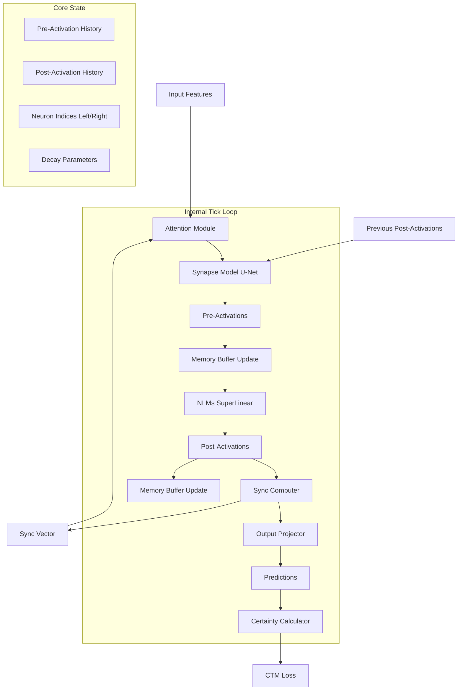

```mermaid
graph TD
    A[Input Features] --> B[Attention Module]
    S[Sync Vector] --> B
    B --> C[Synapse Model U-Net]
    PC[Previous Post-Activations] --> C
    C --> D[Pre-Activations]
    D --> E[Memory Buffer Update]
    E --> F[NLMs SuperLinear]
    F --> G[Post-Activations]
    G --> H[Sync Computer]
    G --> I[Memory Buffer Update]
    H --> J[Output Projector]
    H --> S
    J --> K[Predictions]
    K --> L[Certainty Calculator]
    L --> M[CTM Loss]
    
    subgraph "Internal Tick Loop"
        B
        C
        D
        E
        F
        G
        H
        I
        J
        K
        L
    end
    
    subgraph "Core State"
        N[Pre-Activation History]
        O[Post-Activation History]
        P[Neuron Indices Left/Right]
        Q[Decay Parameters]
    end
```
